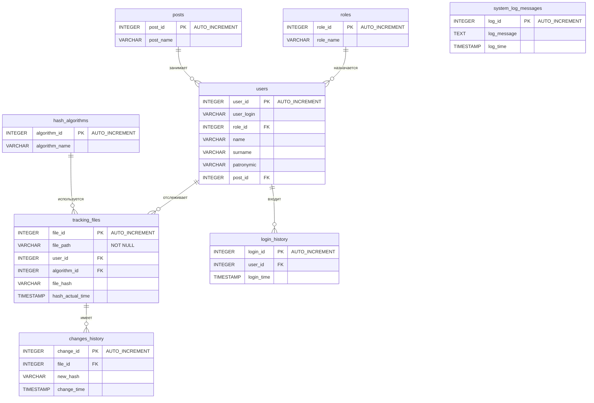

# celcon_daemon
## Описание
ЦЕЛКОН (celcon) - система контроля целостности на основе проверки контрольных сумм файлов из списка отслеживаемых файлов
## Основные функции
- Добавление, изменение и удаление записей в списке отслеживаемых файлов
- Слежение за событиями файлов посредством inotify
- Вычисление контрольных сумм по выбранному пользователем алгоритму в случае возникновения события inotify
- Взаимодействие с пользователем: отправка уведомлений об изменении файлов пользователям, получение данных и команд от пользователя, оповещение пользователя о внештатных ситуациях возникших при отслеживании файлов
## Разделение ролей пользователей
- Наблюдатель (Viewer) - может просматривать список отслеживаемых файлов и их статусы, а также статистику изменений во времени без возможности вносить изменения в список отслеживания и влиять на других пользователей
- Редактор (Editor) - все привелегии Наблюдателя и возможность изменения списка отслеживаемых файлов без возможности влиять на других пользователей
- Администратор (Administrator) - все привелегии Редактора и возможность добавлять, изменять и удалять пользователей и их данные
## Взаимодействие с пользователем
Взаимодействие с пользователем производится посредством сокетов TLS и отправки сообщений в синтаксисе JSON
### Типы сообщений
- Событие (evt) - отправка пользователю сообщений о наступившем событии (например, изменении файлов)
- Команда (cmd) - получение от пользователя команд и сопутствующих данных (например, внесение файла в список отслеживания)
- Ответ на команду (answ) - отправка пользователю ответа на поступившую команду с кодом ответа, текстом сообщения и сопутствующими данными
## Диаграмма базы данных:

